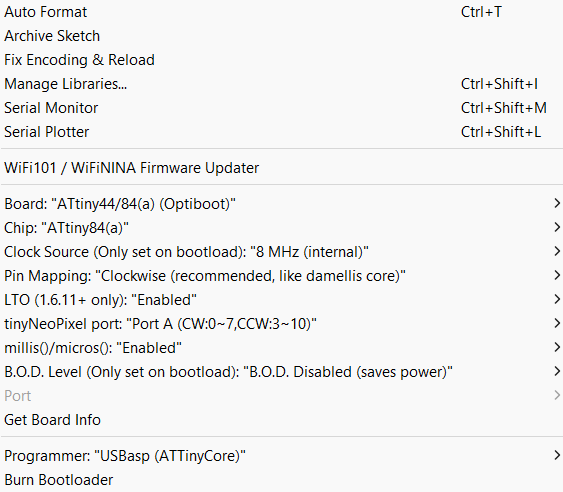
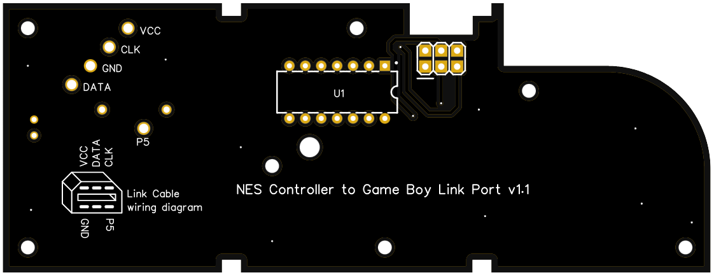
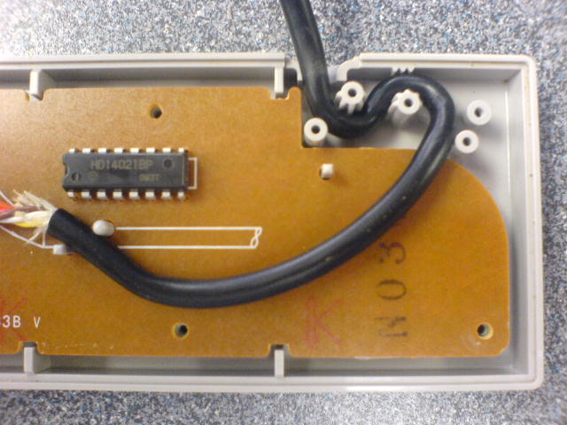

# NES controller to Game Boy linkport PCB

A remote controller in the shape of an NES controller that connects to the Game Boy Link Port


The PCB is 1:1 the size of an NES controller PCB allowing it to fit inside an OEM shell. 

**NOTE:** This board is meant interface with [HerrZatacke](https://github.com/HerrZatacke)'s custom Game Boy Camera ROM [2bit PXLR Studio](https://github.com/HerrZatacke/2bit-pxlr-studio) and [Toxa](https://github.com/untoxa)'s Game Boy Camera ROM [Photo!](https://github.com/untoxa/gb-photo). Currently, it does not work with any other ROMs.

## Materials Needed
* **NES Controller to Game Boy Link Port PCB**
  - [Link under construction]
* **Attiny84**
  - Available at various stores such as [LCSC.com](https://lcsc.com/product-detail/Microcontroller-Units-MCUs-MPUs-SOCs_Microchip-Tech-ATTINY84A-PU_C145560.html)
* **Programming tool** such as an USBasp or an Arduino
  - For the sake of ease, instructions will be for the USBasp (video tutorals for programming Attiny with an Arduino are available on YouTube)
    - USBasp is available at various stores such as [Amazon.com](https://www.amazon.com/Geekstory-Microcontroller-Programmer-Downloader-Adapter/dp/B07NZ59VK2/ref=sr_1_4?crid=3AIOYYUPERXR6&keywords=usbasp&qid=1667392056&qu=eyJxc2MiOiIzLjIyIiwicXNhIjoiMi43OSIsInFzcCI6IjIuODMifQ%3D%3D&sprefix=usbasp%2Caps%2C120&sr=8-4)
    - Ensure the USBasp includes the 10pin cable & 10pin to 6pin adapter
* **Game Boy game link cable**
  - Available at various stores such as [RetroModding.com](https://www.retromodding.com/collections/game-boy-pocket/products/gameboy-color-pocket-game-link-cable?ref=gameboycamera)
    - Use code "**gameboycamera**" at checkout for 5% off
* **NES controller parts**
  - Shell (screws included), buttons, silicone pads available at [RetroModding.com](https://www.retromodding.com/collections/nes?ref=gameboycamera)
    - Use code "**gameboycamera**" at checkout for 5% off
    - Game Boy DMG dpad & A/B buttons will also fit
  - **OR** use an OEM controller for parts

### Optional materials:
* **2x3 2.54mm shrouded angled pin headers**
  - Available at various stores such as [LCSC.com](https://lcsc.com/product-detail/Pin-Headers_DEALON-DZ254W-22-06-69_C2935935.html)
  - **Recommended** if you are new to programming Attiny
  - Also useful if you wish to reprogram the Attiny84 later
* **10k through-hole resistor** & **3mm LED**
  - If you choose to add the LED and resistor, the LED will light when a button is pressed
  - The LED can also assist with troubleshooting button presses and removed later

## Instructions

**1. Program the Attiny84 with [arduino-pxlr-remote.ino](sketch/arduino-pxlr-remote.ino)**
   1. Download the following software:
      - [Zadig](https://zadig.akeo.ie/) - Windows driver for USBasp
      - [Arduino IDE](https://www.arduino.cc/en/software) - for programming the Attiny84
      - [arduino-pxlr-remote.ino](sketch/arduino-pxlr-remote.ino) - sketch for the Attiny84
   2. With USBasp inserted in your computer, open Zadag and install WinUSB**
      * You may need to select *Options > List All Devices* in order for the USBasp to appear
   3. Install Arduino IDE on your computer
   4. Install Attiny board manager in Arduino IDE
      - Under *File > Preferences*, scroll to "Additional board manager URLs"
      - Input the following URL: ``` http://drazzy.com/package_drazzy.com_index.json ``` and click "OK"
      - Under *Tools > Board > Board Manager*, search for Attiny and install "ATTinyCore"
   5. Wire Attiny84 to the USBasp
      - For ease, it is recommended you now solder the Attiny and pin headers to the **BOTTOM** of the board
      - If it is still connected to your computer, remove the USBasp
      - Connect the USBasp, cable, and 6 pin adapter - connect it all to the pin headers on the board
      - Insert the USBasp into your computer
   6. Program the Attiny84 via Arduino IDE
      - Go to *File > Open* and open arduino-pxlr-remote.ino file
      - Under *Tools*, change to the following settings:
        - 
        - Note: *Port* options may or may not appear and will be grayed-out - you can ignore this
      - Once all settings are as above, under *Tools*, select *Burn Bootloader*
      - When that is finished, go to *Sketch > Upload Using Programmer*

**2. Cut & strip the link cable. Use a multimeter to determine which wire coincides with the respective pin**
   - Do **NOT** rely on wire colors! They are rarely correct - confirm the correct wire with a multimeter

**3. Use the diagram on the back of the board to solder the wires - wires should extend from the BACK of the board**
   - 

**4. Solder the Attiny and optional components (if not already done)**
   - Note: LED & resistor should be placed on the front of the board

**5. Test to ensure everything works prior to installing the PCB into the NES controller enclosure**
   - If the LED lights on button press but input is not received in the Game Boy buttons, more than likely this is a wiring issue - double-check the wiring diagram and use your mutimeter to ensure you've soldered the correct wires 
   - Mind the spokes inside the shell for cable routing to ensure the wires aren't ripped from the solder joints from tension or pulling, as seen below
     - 

## Contributions
* [HerrZatacke](https://github.com/HerrZatacke) - Attiny84 code, ROM code, [2bit PXLR Studio](https://github.com/HerrZatacke/2bit-pxlr-studio) ROM creator, testing, assistance, support, & ideas
* [Toxa](https://github.com/untoxa) - [Photo!](https://github.com/untoxa/gb-photo) ROM creator
* [HDR](https://github.com/HDR) - [Game Boy Camera flash cart](https://github.com/HDR/Gameboy-Camera-Flashcart) creator
* [Game Boy Camera Club Discord members](https://discord.gg/C7WFJHG) - support & ideas

## Troubleshooting

[Under construction]

## Need help?
In the Game Boy Camera Club Discord #Projects channel, find the NES Controller projects and ask your questions there.
